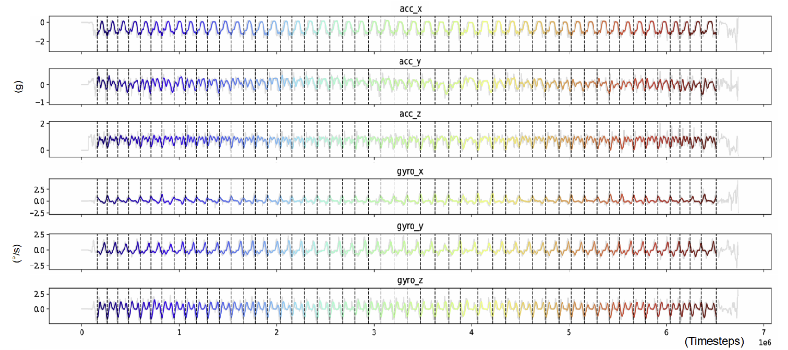

Hardware and data flow
======================

Name That Move does not require a particular sensor brand, phone, or OSC app.
It operates on the six-channel :doc:`data_contract`, so users may replace any
acquisition component that can produce compatible data.

What six-axis IMU data look like
--------------------------------

A six-axis IMU combines two complementary types of movement measurement. The
three accelerometer channels describe motion and gravity-related changes along
the x, y, and z axes, while the three gyroscope channels describe rotation
around those axes. Together, they produce a six-channel time series that
captures multiple physical aspects of movement. In the example below, a
performer repeatedly traces the same triangular movement. Each colored span is
one complete repetition, and the six stacked curves show how that single
movement appears across all six IMU channels.

   Example six-channel IMU recording from an early triangular-movement study.
   The top three rows show accelerometer channels (``acc_x``, ``acc_y``, and
   ``acc_z``, in g); the bottom three show gyroscope channels (``gyro_x``,
   ``gyro_y``, and ``gyro_z``, in degrees per second). Raw signals are shown in
   gray. Colored traces and dashed boundaries show 50 segmented repetitions of
   a triangular movement.

.. container:: image-provenance

   This historical research visualization illustrates the six-channel
   representation and is separate from the bundled Name That Move tutorial
   dataset. It was created by Ziyu Xu (Rose Xu) and originally presented as
   part of a collaborative research poster. Copyright Ziyu Xu (Rose Xu), used
   with permission, and not covered by the package's MIT license.

Tested reference OSC setup
--------------------------

The reference setup tested for this project uses:

* a six-axis IMU sensor (Movesense Sport);
* a phone running a BLE-to-OSC data-transmitter app (Holon.ist on iPhone);
* a macOS or Windows computer running Name That Move; and
* a shared Wi-Fi network for the phone and computer.

The data path is:

.. code-block:: text

   Six-axis IMU sensor (for example, Movesense Sport)
       │  BLE
       ▼
   Phone + data-transmitter app (optional bridge at the package level;
                                 required for this tested OSC path)
       │  OSC over Wi-Fi
       ▼
   Name That Move on the computer
       ├── recorded IMU windows
       └── optional inference → TouchDesigner or another media system

For this reference path, the phone app is the OSC sender. Configure it with the
computer's local IP address and the same UDP port that Name That Move will
receive. In the tested setup, these settings are entered in Holon.ist. The
default package port is ``10000``. Both devices must be on the same Wi-Fi
network. The phone bridge is not a package-wide requirement: another supported
acquisition adapter may provide compatible six-channel data directly.

Ways to send sensor data
------------------------

.. rst-class:: acquisition-table-intro

Name That Move keeps receiving sensor data separate from window construction,
recording, and inference. The stable release currently supports OSC input from
any sender that follows the documented channel paths. A direct
Movesense-to-laptop BLE adapter is under development as an additional choice,
not a replacement for generic OSC input.

.. list-table:: OSC bridge and direct BLE at a glance
   :class: acquisition-comparison
   :header-rows: 1
   :widths: 18 38 38

   * - Transport
     - Advantages
     - Tradeoffs
   * - Phone + OSC
     - Uses the tested performance workflow; keeps the Bluetooth connection
       close to a performer; Wi-Fi can cover a larger stage-to-computer
       distance; and works with tools such as TouchDesigner.
     - Requires a phone, a compatible bridge app, shared Wi-Fi, and matching
       IP address, port, IMU ID, and OSC paths.
   * - Direct BLE
     - Removes the phone and Wi-Fi bridge; reduces setup steps; and lets the
       package receive sensor measurements directly on the laptop.
     - Requires compatible sensor firmware and a laptop BLE connection; has a
       shorter practical range; and is not yet part of the stable release.

Both choices will converge on the same six-channel sample interface and the
same :doc:`data_contract`. The selected transport must not change channel
names, order, units, sampling configuration, or model compatibility. After
acquisition, both paths reuse the same window buffer, background recorder,
local or remote inference worker, and optional TouchDesigner output.

.. code-block:: text

   IMU sensor ──> transmitter + OSC ──┐
                                      ├──> shared IMU samples and windows
   compatible IMU ── direct BLE ──────┘       ├── recording
                                              ├── local/remote inference
                                              └── TouchDesigner output

Expected OSC addresses
----------------------

For the phone-based OSC transmitter option (for example, an iPhone running
Holon.ist), the transmitter app assigns an OSC address to each sensor
measurement. Configure those addresses to match the paths expected by Name That
Move.

In the tested Holon.ist setup, each sensor uses a leading ``/m/<IMU ID>``
prefix. With the default sensor identifier, IMU ID ``1``, Name That Move expects:

.. code-block:: text

   /m/1/acc/x
   /m/1/acc/y
   /m/1/acc/z
   /m/1/gyro/x
   /m/1/gyro/y
   /m/1/gyro/z

If your sender keeps the ``/m/<IMU ID>`` convention but uses another sensor
number, set ``--imu-id`` to that number. If it uses a different leading path,
replace the whole prefix with ``--osc-prefix``. For example,
``--osc-prefix /wearable/right-wrist`` expects
``/wearable/right-wrist/acc/x`` through
``/wearable/right-wrist/gyro/z``.

Only the leading prefix is configurable. The six channel suffixes
(``/acc/x``, ``/acc/y``, ``/acc/z``, ``/gyro/x``, ``/gyro/y``, and
``/gyro/z``) remain fixed, so the sender and receiver must use exactly the same
full addresses. The
receiving port is also configurable. TouchDesigner can inspect incoming OSC
before recording; close it or any other application using the chosen UDP port
before starting the package receiver.

Sampling interpretation
-----------------------

Native sensor measurements and BLE/OSC messages may arrive at non-uniform
times. The real-time pipeline stores the latest value for each named channel
and samples the latest complete six-channel state onto a configurable, uniform
model-input timeline. The default is 48 Hz. To record at a different rate, use
``--sample-rate``; for example, this records 60 Hz windows using the other
receiver defaults:

.. code-block:: console

   name-that-move-record \
     --label circle \
     --session circle_60hz \
     --sample-rate 60

Therefore, 48 Hz is a package configuration chosen for this research workflow,
not a claim that every native sensor message arrives at exactly 48 Hz. Units,
channel order, sampling configuration, and window duration used for inference
must match those used for training. Use the same ``--sample-rate`` value when
running real-time or offline inference with the resulting model.

Alternative hardware
--------------------

Every part of the tested Movesense/Holon.ist setup is replaceable. Users may
choose another IMU sensor, transmitter app, phone or computer platform, and
downstream media system. The acquisition path must ultimately provide the six
named channels and satisfy the same data contract. Direct
Movesense-to-laptop BLE support is optional future work and is not required
for the current vendor-neutral OSC workflow.
