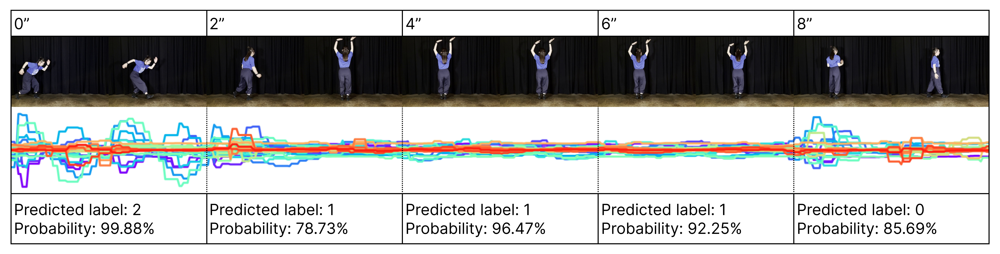
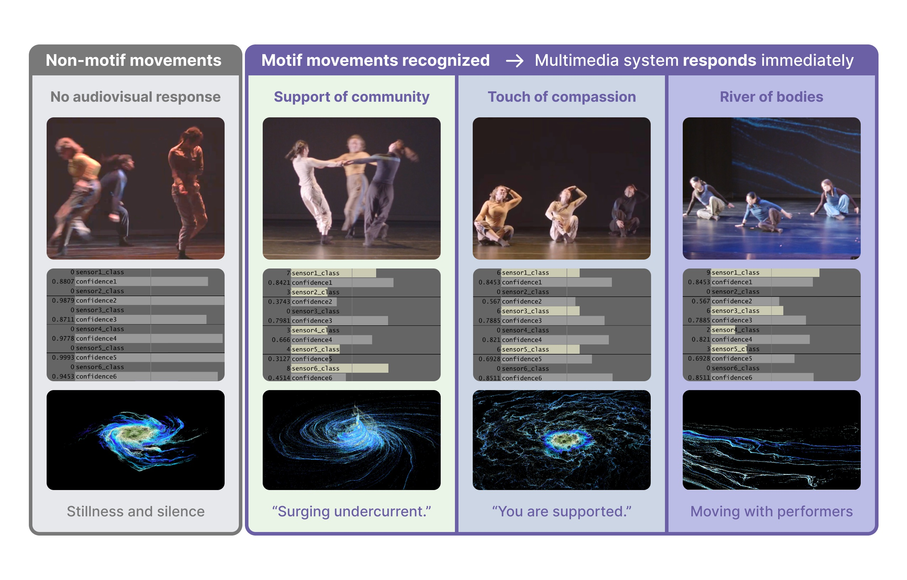

Build a real-time performance application
=========================================

After you :doc:`record movement data <recording>`, :doc:`train a model
<training>`, and :doc:`run inference <inference>`, the final step is to decide
how the prediction should affect a performance or interactive work. A movement
label and confidence value can control sound, projected images, lighting,
text, haptics, or another system that can receive the result.

This page shows that creative-application step with the included TouchDesigner
example. For sensor, phone-app, and OSC connection options, see
:doc:`hardware_setup`.

From movement to a creative response
------------------------------------

During live use, Name That Move continuously receives the latest values from
the accelerometer and gyroscope. It groups the six channels into complete
windows, then saves or classifies each window without stopping the incoming
sensor stream:

.. code-block:: text

   IMU sensor + data-transmitter app
                  │ six-channel OSC data
                  ▼
           Name That Move
                  │ build a complete IMU window
                  ▼
          six-channel window
             ├── optional recording
             └── local or remote inference
                       ├── print label + confidence
                       └── optional TouchDesigner output

OSC is currently the supported way to send live sensor data into the package.
A future direct-BLE option can provide another route from a compatible sensor
to the same window-building, recording, inference, and TouchDesigner steps. It
will complement rather than replace the more flexible OSC workflow.

What this can look like in performance
--------------------------------------

The following 10-second mock performance makes windowed inference visible. The
dancer changes movement over time, while the system assigns one label and
confidence value to each two-second window. Confidence can decrease during a
transition because one window may contain parts of two different movements.

   Real-time motion classification during a 10-second mock performance. From
   `Human-Machine Ritual: Synergic Performance through Real-Time Motion Recognition
   <https://arxiv.org/abs/2511.02351>`_, Figure 3 (Cai, Xu, and Pampin, 2025).
   Reproduced under `CC BY-NC-ND 4.0
   <https://creativecommons.org/licenses/by-nc-nd/4.0/>`_; this image is not
   covered by the package's MIT license.

Recognition becomes artistically meaningful when its output is mapped to
media behavior. In the live-performance example below, non-motif movement
preserves stillness and silence, while recognized movement motifs activate
specific projected imagery and spoken text. A label does not prescribe one
effect: artists can map it to sound, light, video, text, or any other system
that can receive the result.

   Interactive system responses during live performance. From `Creativity ≠
   Generativity: A Case Study of Attentive Machine Learning in Dance Performance
   <https://doi.org/10.1145/3816094>`_, Figure 2 (Xu and Cai, 2026).
   Reproduced under `CC BY-NC-ND 4.0
   <https://creativecommons.org/licenses/by-nc-nd/4.0/>`_; this image is not
   covered by the package's MIT license.

.. raw:: html

   

     <strong>
       <a href="https://vimeo.com/1154055115">Watch the five-minute concert excerpt.</a>
     </strong>
   

   

     <iframe
       src="https://player.vimeo.com/video/1154055115?title=0&amp;byline=0&amp;portrait=0"
       title="Five-minute concert excerpt"
       loading="lazy"
       allow="autoplay; fullscreen; picture-in-picture"
       allowfullscreen>
     </iframe>
   

Try the included TouchDesigner application
------------------------------------------

The repository includes a ready-to-open
:download:`TouchDesigner visualizer <../examples/touchdesigner/name_that_move_visualizer.toe>`
and its :download:`setup notes <../examples/touchdesigner/README.md>`. The patch
receives live labels and confidence values, smooths the confidence signal,
ignores uncertain predictions below a selected threshold, and maps ``still``,
``triangle``, and ``circle`` to simple visuals. Replace those starter mappings
with your own audiovisual or performance controls.

This complete example uses the bundled local model. It receives six-channel
IMU data on UDP port ``10000``, classifies each completed window, and sends
every successful prediction to TouchDesigner on UDP port ``8000``:

.. code-block:: console

   name-that-move-live \
     --model-dir examples/models/still_triangle_circle \
     --model-tag still_triangle_circle_v0 \
     --ip 0.0.0.0 \
     --port 10000 \
     --imu-id 1 \
     --sample-rate 48 \
     --window-duration 2 \
     --startup-timeout 2 \
     --touchdesigner-ip 127.0.0.1 \
     --touchdesigner-port 8000 \
     --touchdesigner-path /sensor/1

TouchDesigner receives the label at ``/sensor/1/label`` and confidence at
``/sensor/1/confidence``. Port ``10000`` is the sensor-data input; port ``8000``
is the separate prediction output. If the incoming sensor addresses do not
begin with the default ``/m/1``, add ``--osc-prefix /your/prefix``. To use a
remote model, replace ``--model-dir`` and ``--model-tag`` with ``--remote-url``
and, optionally, ``--http-timeout``.

Prepare the application for a live run
--------------------------------------

Before a rehearsal or performance:

1. Confirm that all six sensor channels reach the computer. The default OSC
   paths begin with ``/m/1``; use ``--osc-prefix`` if your sender uses a
   different beginning.
2. Use a model trained with the same sample rate, window duration, channel
   order, sensor units, placement, and orientation as the live stream.
3. Choose local inference or connect to a compatible remote HTTP model server.
   Name That Move does not provide a hosted model server.
4. Keep the TouchDesigner prediction port separate from the sensor-input port.
   The public example uses port ``10000`` for incoming sensor data and port
   ``8000`` for outgoing predictions.
5. Verify the printed label and confidence first, then confirm that
   TouchDesigner responds to the intended labels and confidence threshold.

The live command stops with a clear message if all six OSC channels do not
arrive within ``--startup-timeout``. Check the sender's destination IP, UDP
port, OSC prefix, and whether another application is already using the input
port.

Why the stream can keep running
-------------------------------

As soon as one window is complete, Name That Move begins collecting the next
one. File saving and model inference run separately from the incoming sensor
stream. A slow disk, network request, or model therefore does not pause sensor
collection, and the package limits queued work so that delays cannot create an
unlimited backlog.

Keep the live stream compatible with the model
----------------------------------------------

The live sensor configuration must match the configuration saved with the
model. For example, a model trained with six channels sampled at 48 Hz for two
seconds expects a ``(6, 96)`` window. Changing the sampling rate, duration,
channel order, units, sensor placement, or orientation may require compatible
preprocessing or retraining.

The TouchDesigner example can smooth confidence values and ignore predictions
below a selected threshold, but those downstream controls do not repair an
incompatible sensor stream or model.
